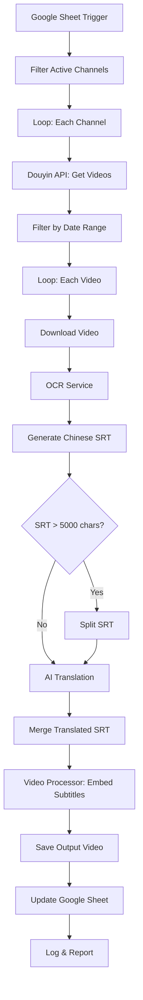

# Design Document: Douyin Video Workflow

## Overview

Hệ thống n8n workflow tự động hóa quy trình xử lý video Douyin với các bước: lấy dữ liệu từ Google Sheet, tải video, trích xuất phụ đề bằng OCR, dịch sang tiếng Việt bằng AI, và ghép phụ đề vào video. Workflow được thiết kế modular để dễ bảo trì và mở rộng.

## Technology Stack

| Component | Technology | Ghi chú |
|-----------|------------|---------|
| **Runtime** | n8n + Node.js | Workflow automation platform |
| **OCR** | PaddleOCR (self-hosted) hoặc Baidu OCR | Tối ưu cho tiếng Trung |
| **Translation** | OpenAI GPT-4o-mini | ~$0.15/1M input tokens |
| **Video Processing** | FFmpeg | Ghép phụ đề, encode video |
| **Video Download** | yt-dlp | Hỗ trợ Douyin, cập nhật thường xuyên |
| **Data Storage** | Google Sheets API | Quản lý channels và tracking |
| **File Storage** | Google Drive API | Lưu trữ video đã xử lý |

### Dependencies
```json
{
  "dependencies": {
    "googleapis": "^130.0.0",
    "openai": "^4.0.0",
    "fluent-ffmpeg": "^2.1.2",
    "srt-parser-2": "^1.2.3",
    "axios": "^1.6.0"
  },
  "devDependencies": {
    "typescript": "^5.0.0",
    "fast-check": "^3.15.0",
    "jest": "^29.0.0",
    "@types/node": "^20.0.0",
    "@types/fluent-ffmpeg": "^2.1.24"
  }
}
```

### External Tools (cần cài đặt trên server)
- **yt-dlp**: `pip install yt-dlp` hoặc `brew install yt-dlp`
- **FFmpeg**: `apt install ffmpeg` hoặc `brew install ffmpeg`
- **PaddleOCR** (nếu self-host): Docker image `paddlepaddle/paddle:2.5.0`

### Environment Variables
```bash
# Google APIs
GOOGLE_SHEET_ID=your_sheet_id
GOOGLE_DRIVE_FOLDER_ID=your_folder_id
GOOGLE_CREDENTIALS=path/to/credentials.json

# OCR Service
OCR_API_KEY=your_ocr_api_key
OCR_ENDPOINT=https://aip.baidubce.com/rest/2.0/ocr/v1/general

# OpenAI
OPENAI_API_KEY=your_openai_api_key

# Optional
ALERT_WEBHOOK_URL=your_slack_or_discord_webhook
```

## Architecture



## Components and Interfaces

### 1. Google Sheet Manager
```typescript
interface GoogleSheetManager {
  connect(sheetId: string): Promise<Connection>;
  getRows(): Promise<Row[]>;
  filterByStatus(rows: Row[], status: string): Row[];
  updateRow(rowId: string, data: Partial<Row>): Promise<void>;
  updateProcessingStatus(rowId: string, status: ProcessingStatus): Promise<void>;
}

interface Row {
  id: string;
  user_id: string;
  lastprocess: string; // ISO date format
  status: string;
  output_location?: string;
  processing_status?: ProcessingStatus;
}
```

### 1.1 Google Drive Manager
```typescript
interface GoogleDriveManager {
  connect(): Promise<Connection>;
  uploadFile(localPath: string, fileName: string): Promise<DriveFile>;
  getFileUrl(fileId: string): string;
}

interface DriveFile {
  id: string;
  name: string;
  webViewLink: string;
  webContentLink: string;
}
```

### 2. Douyin Video Fetcher (yt-dlp)
```typescript
interface DouyinFetcher {
  getVideosByDateRange(userId: string, fromDate: Date, toDate: Date): Promise<VideoInfo[]>;
  downloadVideo(videoUrl: string, outputPath: string): Promise<string>;
}

interface VideoInfo {
  id: string;
  title: string;
  duration: number; // seconds
  publishDate: Date;
  downloadUrl: string;
}

// yt-dlp command example:
// yt-dlp --cookies cookies.txt -o "%(id)s.%(ext)s" --write-info-json <douyin_url>
```

### 3. OCR Service (PaddleOCR / Baidu OCR)
```typescript
interface OCRService {
  extractText(videoPath: string): Promise<OCRResult>;
}

interface OCRResult {
  segments: TextSegment[];
  language: string;
}

interface TextSegment {
  text: string;
  startTime: number; // milliseconds
  endTime: number;   // milliseconds
}

// PaddleOCR config example:
interface PaddleOCRConfig {
  use_gpu: boolean;
  lang: 'ch';  // Chinese
  det_model_dir: string;
  rec_model_dir: string;
  frame_interval: number; // Extract frame every N seconds
}

// Baidu OCR API example:
interface BaiduOCRConfig {
  api_key: string;
  secret_key: string;
  endpoint: 'https://aip.baidubce.com/rest/2.0/ocr/v1/general';
}
```

### 4. SRT Generator & Parser
```typescript
interface SRTManager {
  generate(segments: TextSegment[]): string;
  parse(srtContent: string): TextSegment[];
  split(srtContent: string, maxChars: number): string[];
  merge(srtParts: string[]): string;
  validate(segments: TextSegment[]): ValidationResult;
}

interface ValidationResult {
  isValid: boolean;
  errors: string[];
}
```

### 5. AI Translation Service (OpenAI GPT-4o-mini)
```typescript
interface TranslationService {
  translate(text: string, sourceLang: string, targetLang: string): Promise<string>;
  translateSRT(srtContent: string): Promise<string>;
}

// OpenAI config
interface OpenAIConfig {
  apiKey: string;
  model: 'gpt-4o-mini';
  maxTokens: 4096;
  temperature: 0.3; // Lower for more consistent translations
}

// Translation prompt template
const TRANSLATION_PROMPT = `
Translate the following Chinese subtitle text to Vietnamese.
Keep the same line structure and timing markers.
Maintain natural Vietnamese expression while preserving the original meaning.

Chinese text:
{input}

Vietnamese translation:
`;
```

### 6. Video Processor (FFmpeg)
```typescript
interface VideoProcessor {
  embedSubtitles(videoPath: string, srtPath: string, outputPath: string): Promise<string>;
  adjustSubtitleTiming(srtContent: string, audioDuration: number): string;
  analyzeAudioPace(videoPath: string): Promise<AudioAnalysis>;
}

interface AudioAnalysis {
  duration: number;
  speechSegments: { start: number; end: number }[];
  averagePace: number; // words per minute
}

// FFmpeg commands:
// Embed soft subtitles (can be toggled):
// ffmpeg -i input.mp4 -i subtitles.srt -c copy -c:s mov_text output.mp4

// Burn-in subtitles (hardcoded):
// ffmpeg -i input.mp4 -vf "subtitles=subtitles.srt:force_style='FontSize=24,FontName=Arial'" output.mp4

// Extract audio for analysis:
// ffmpeg -i input.mp4 -vn -acodec pcm_s16le -ar 16000 -ac 1 output.wav
```

### 7. Logger & Reporter
```typescript
interface Logger {
  info(message: string, metadata?: object): void;
  warn(message: string, metadata?: object): void;
  error(message: string, error: Error, metadata?: object): void;
  generateReport(results: ProcessingResult[]): Report;
}

interface ProcessingResult {
  videoId: string;
  status: 'success' | 'failed';
  duration: number;
  error?: string;
}

interface Report {
  totalProcessed: number;
  successCount: number;
  failureCount: number;
  details: ProcessingResult[];
}
```

## Data Models

### Google Sheet Schema
| Column | Type | Description |
|--------|------|-------------|
| user_id | string | Douyin channel user ID |
| lastprocess | date | Last processing date (ISO format) |
| status | string | Channel status (Started/Stopped/Paused) |
| output_location | string | Path to processed videos |
| processing_status | string | Current processing status |

### SRT File Format
```
1
00:00:01,000 --> 00:00:04,000
第一行字幕文本

2
00:00:04,500 --> 00:00:08,000
第二行字幕文本
```

### Video Metadata
```typescript
interface VideoMetadata {
  id: string;
  originalTitle: string;
  duration: number;
  publishDate: Date;
  sourcePath: string;
  outputPath: string;
  chineseSrtPath: string;
  vietnameseSrtPath: string;
  processingStatus: ProcessingStatus;
}

enum ProcessingStatus {
  PENDING = 'Pending',
  PROCESSING = 'Processing',
  DOWNLOADING = 'Downloading',
  OCR_PROCESSING = 'OCR_Processing',
  TRANSLATING = 'Translating',
  EMBEDDING = 'Embedding',
  UPLOADING = 'Uploading',
  COMPLETED = 'Completed',
  FAILED = 'Failed',
  SYNC_FAILED = 'Sync_Failed',
  UPLOAD_FAILED = 'Upload_Failed'
}
```

## Correctness Properties

*A property is a characteristic or behavior that should hold true across all valid executions of a system-essentially, a formal statement about what the system should do. Properties serve as the bridge between human-readable specifications and machine-verifiable correctness guarantees.*

### Property 1: Status Filtering Correctness
*For any* set of Google Sheet rows with various statuses, filtering by "Started" status SHALL return only rows where status equals "Started" and no other rows.
**Validates: Requirements 1.2**

### Property 2: Field Extraction Completeness
*For any* row with status "Started", the extracted data SHALL contain both user_id and lastprocess fields with non-empty values.
**Validates: Requirements 1.3**

### Property 3: Invalid Row Filtering
*For any* row with missing user_id or missing lastprocess, that row SHALL be excluded from processing and a warning SHALL be logged.
**Validates: Requirements 1.5**

### Property 4: Date Range Video Filtering
*For any* Douyin channel and date range [lastprocess, currentDate], all returned videos SHALL have publishDate >= lastprocess AND publishDate <= currentDate.
**Validates: Requirements 2.1**

### Property 5: Video Metadata Completeness
*For any* downloaded video, the stored metadata SHALL contain title, duration, and publishDate fields with valid values.
**Validates: Requirements 2.6**

### Property 6: OCR Output Format
*For any* OCR result, each text segment SHALL contain non-empty text, valid startTime, and valid endTime where startTime < endTime.
**Validates: Requirements 3.2**

### Property 7: SRT Generation Round Trip
*For any* valid list of TextSegments, generating an SRT file and then parsing it back SHALL produce equivalent TextSegments with identical text and timing.
**Validates: Requirements 3.3**

### Property 8: SRT Timestamp Validation
*For any* generated SRT file, all timestamps SHALL be sequential (each segment starts after or at the previous segment's end) and non-overlapping.
**Validates: Requirements 3.5**

### Property 9: SRT Split Preservation
*For any* SRT content exceeding 5000 characters, splitting and then merging SHALL produce content equivalent to the original.
**Validates: Requirements 4.2, 4.3**

### Property 10: Timestamp Preservation After Translation
*For any* SRT file, after translation the timestamps SHALL remain identical to the original timestamps.
**Validates: Requirements 4.4**

### Property 11: Subtitle Synchronization
*For any* video with embedded subtitles, each subtitle display time SHALL align with the corresponding audio segment within a tolerance of 100ms.
**Validates: Requirements 5.2**

### Property 12: Error Log Completeness
*For any* workflow step failure, the error log entry SHALL contain timestamp, step name, and error message fields.
**Validates: Requirements 6.1**

### Property 13: Report Accuracy
*For any* batch of processed videos, the summary report's successCount + failureCount SHALL equal totalProcessed.
**Validates: Requirements 6.4**

### Property 14: Processing Status Tracking
*For any* video being processed, the processing_status in Google Sheet SHALL be updated at each step transition (Processing → Downloading → OCR_Processing → Translating → Embedding → Uploading → Completed).
**Validates: Requirements 1.6, 2.7, 3.6, 4.6, 5.4, 5.6**

### Property 15: Environment Variables Validation
*For any* workflow startup, all required environment variables (GOOGLE_SHEET_ID, GOOGLE_DRIVE_FOLDER_ID, GOOGLE_CREDENTIALS, OCR_API_KEY, OPENAI_API_KEY) SHALL be present and non-empty.
**Validates: Requirements 7.1, 7.2, 7.3, 7.4, 7.5, 7.6**

## Error Handling

### Retry Strategy
| Component | Max Retries | Delay | Backoff |
|-----------|-------------|-------|---------|
| Google Sheet Connection | 3 | 30s | Linear |
| Video Download | 3 | 10s | Exponential |
| OCR Service | 2 | 5s | Linear |
| AI Translation | 3 | 5s | Linear |
| Video Processing | 2 | 10s | Linear |

### Error Categories
1. **Recoverable**: Network timeouts, rate limits → Retry with backoff
2. **Partial Failure**: Single video fails → Continue with others, log error
3. **Critical**: Sheet connection fails after retries → Stop workflow, send alert

### Fallback Mechanisms
- OCR fails → Mark for manual subtitle creation
- Translation fails → Mark for manual translation
- Sync fails → Generate timing discrepancy report

## Testing Strategy

### Unit Testing
- Test individual functions: filtering, SRT parsing/generation, date range calculations
- Mock external services (Google Sheet API, Douyin API, OCR, Translation)
- Test error handling paths

### Property-Based Testing
Sử dụng thư viện **fast-check** cho TypeScript để implement property-based tests.

Mỗi property test PHẢI:
- Chạy tối thiểu 100 iterations
- Được annotate với format: `**Feature: douyin-video-workflow, Property {number}: {property_text}**`
- Reference requirement clause mà property validates

### Integration Testing
- Test n8n workflow nodes connectivity
- Test end-to-end flow with mock services
- Test Google Sheet read/write operations

### Test Coverage Requirements
- Unit tests: Core logic functions
- Property tests: Data transformation correctness
- Integration tests: Workflow node connections
