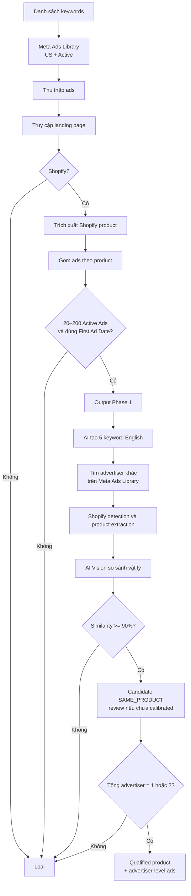

# Product Research Dropshipping trên Meta Ads Library

## 1. Nguồn và phạm vi xác nhận

| Nguồn | Nội dung sử dụng | Ghi chú |
|---|---|---|
| `TOOL TÌM SẢN PHẨM DROPSHIPPING TRÊN META ADS LIBRARY.docx` | Functional requirements và business rules | Là nguồn yêu cầu chính. |
| [Meta Ad Library Help Center](https://www.facebook.com/help/259468828226154) | Bối cảnh sản phẩm nguồn | Meta mô tả Ad Library là nơi tìm quảng cáo đang chạy; dữ liệu/hiển thị có thể thay đổi. Cần kiểm chứng kỹ thuật trước khi chốt phương án lấy dữ liệu. |

**In scope:** Meta Ads Library, landing page, Shopify store/product page và US market.  
**Out of scope hiện tại:** phát hiện đối thủ gián tiếp, cùng ngành hàng, sản phẩm thay thế, các nền tảng store khác Shopify và thị trường ngoài US.

---

## 2. Tổng hợp nội dung

- Giao diện Meta Ads Library: chọn quốc gia, loại quảng cáo và tìm theo keyword/advertiser.
- Bối cảnh cần xây dựng công cụ hỗ trợ product research dropshipping ở thị trường US, với Meta Ads Library là nguồn phát hiện quảng cáo và landing page.
- Tài liệu requirement được mở, rà soát theo luồng hai giai đoạn: **Product Discovery** trước, sau đó mới **tìm direct competitor**.
- Quy tắc trọng tâm được nhấn mạnh trong tài liệu đang trình bày: chỉ đi sâu vào Shopify; đếm Active Ads theo từng product thay vì theo toàn Fan Page; chỉ giữ sản phẩm có tổng 1–2 advertiser bán cùng mẫu vật lý.
- Cuối buổi, người chia sẻ gửi link tài liệu requirement và Meta Ads Library cho nhóm để tiếp tục triển khai/tra cứu.

---

## 3. Mục tiêu sản phẩm

Tự động hoá việc tìm sản phẩm dropshipping có cơ hội tham gia thị trường khi:

1. Sản phẩm có **20–200 Active Ads**.
2. **First Ad Date** nằm trong khoảng cấu hình; mặc định là **2–4 tuần gần nhất**.
3. Tổng số advertiser đang bán **cùng mẫu sản phẩm vật lý** là **1–2**.

Khi thỏa điều kiện (3), đội vận hành có thể trở thành advertiser thứ 2 hoặc thứ 3. Công cụ phải ưu tiên hiển thị advertiser đang triển khai mạnh nhất để phục vụ nghiên cứu creative, hook, angle, offer và format.

---

## 4. Business rules ghi nhận từ requirement

> Các rule dưới đây được xem là **business intent của tài liệu nguồn**, chưa đồng nghĩa toàn bộ đã đủ chi tiết để đội kỹ thuật implement. Những điểm còn mơ hồ được chuyển thành quyết định cần chốt tại mục 9.

| Mã | Quy tắc |
|---|---|
| BR-01 | Chỉ xử lý kết quả ở US market và Active Ads, trừ khi cấu hình chạy quy định khác. |
| BR-02 | Shopify detection phải diễn ra sớm nhất có thể. Landing page không phải Shopify thì loại ngay; không crawl sâu và không gọi AI. |
| BR-03 | Một Fan Page có thể quảng cáo nhiều sản phẩm. Không được lấy tổng Active Ads của Fan Page làm số ads của product. |
| BR-04 | Active Ads phải được gom và đếm theo từng product. |
| BR-05 | Giai đoạn 1 chỉ tìm product đủ điều kiện; chưa tìm competitor. |
| BR-06 | Giai đoạn 2 chỉ chạy với product đã pass giai đoạn 1. |
| BR-07 | `SAME_PRODUCT` khi physical-product similarity >= 90%. |
| BR-08 | Khi so sánh sản phẩm, đánh giá hình dáng, model, cấu tạo, màu sắc, tỷ lệ/kích thước, đặc điểm vật lý và phụ kiện; không loại do khác brand, logo, tên, text bao bì, background hay thiết kế quảng cáo. |
| BR-09 | Không cần phân loại similar product, indirect competitor, same niche/category/problem hay substitute. Kết quả dưới ngưỡng 90% bị loại. |
| BR-10 | Chỉ giữ product có tổng cộng 1–2 advertiser cùng bán `SAME_PRODUCT`; 3 advertiser trở lên phải loại. |
| BR-11 | Active Ads phải được lưu riêng cho mỗi advertiser, không chỉ tổng theo product. |

---

## 5. Luồng nghiệp vụ

---

## 6. Functional requirements

### 6.1. Thiết lập một lần chạy

| Field | Yêu cầu | Giá trị mặc định |
|---|---|---|
| Keywords | Danh sách keyword seed để tìm quảng cáo | Bắt buộc nhập |
| Market | Quốc gia hiển thị/tìm ads | `US` |
| Ad status | Trạng thái quảng cáo | `Active` |
| First-ad window | Khoảng ngày First Ad Date được phép | 2–4 tuần gần nhất |
| Min/Max active ads | Ngưỡng số Active Ads theo product | 20 / 200 |
| Same-product threshold | Ngưỡng AI Vision | 90% |

Mỗi run phải có `run_id`, thời điểm bắt đầu/kết thúc, cấu hình đã dùng và trạng thái từng bước để có thể audit/retry.

### 6.2. Thu thập ads từ Meta Ads Library

Với mỗi ad, cố gắng thu thập các dữ liệu sau (dữ liệu nào không xuất hiện được phải lưu trạng thái thiếu, không tự bịa):

| Nhóm | Dữ liệu |
|---|---|
| Định danh | `ad_id`, `advertiser/page_id` nếu có, advertiser/page name, ads-library URL |
| Thời gian | `ad_start_date`, `observed_at` (thời điểm crawler nhìn thấy ad active) |
| Nội dung | ad text, headline, CTA, creative format |
| Liên kết | landing page URL gốc, final/canonical URL sau redirect |
| Creative | image URL, video URL/thumbnail URL nếu có, local/object-storage reference nếu được tải về |

### 6.3. Shopify detection và product extraction

1. Theo redirect của landing page với giới hạn an toàn; chuẩn hóa domain và canonical URL.
2. Chạy Shopify detection trước mọi bước tốn tài nguyên như crawl sâu hoặc AI.
3. Nếu Shopify, xác định trang product và trích xuất tối thiểu:
   - `product_title`
   - `product_url` (canonical)
   - product images
   - description nếu có
   - price/currency nếu có
4. Một landing page có thể là collection/home/upsell page. Cần lưu `product_resolution_status`; chỉ dùng product đã xác định rõ để tính chỉ số.

### 6.4. Gom nhóm và lọc Phase 1

Mỗi ad Shopify hợp lệ phải được liên kết tới một product. Với từng product:

- Tính `active_ads_count` từ các ad **đang active tại thời điểm crawl** đã map vào product.
- Tính `first_ad_date` theo định nghĩa đã chốt ở phần open questions.
- Giữ product nếu `20 <= active_ads_count <= 200` và `first_ad_date` trong date window.

**Output Phase 1 bắt buộc:** product image, website/domain, product URL, first ad date, active ads và Meta Ads Library URL. Cần lưu thêm advertiser nguồn để phục vụ Phase 2.

### 6.5. Tìm và xác nhận direct competitor (Phase 2)

1. Từ product page + ảnh product nguồn, AI sinh 5 English keyword có độ đặc hiệu phù hợp để tìm advertiser bán cùng mẫu.
2. Dùng các keyword đó tìm ads/advertiser/landing page khác trên Meta Ads Library.
3. Áp dụng lại Shopify detection và product extraction như Phase 1.
4. AI Vision chấm độ giống **sản phẩm vật lý**, lưu `similarity_score`, lý do ngắn gọn và bằng chứng ảnh đã so sánh.
5. Nếu `similarity_score >= 90`, gán `SAME_PRODUCT_CANDIDATE`. Cho đến khi model được calibrate và đạt target quality đã duyệt, cần human review trước khi chuyển thành `SAME_PRODUCT`; sau đó mới deduplicate advertiser để đếm.
6. Tính tổng advertiser, gồm advertiser nguồn ở Phase 1. Chỉ product có tổng 1–2 advertiser được `QUALIFIED`.

### 6.6. Output cuối cùng

Mỗi qualified product cần hiển thị/xuất được:

| Nhóm | Dữ liệu |
|---|---|
| Product gốc | image, domain, product URL, first ad date, active ads, Meta Ads Library URL |
| Mỗi advertiser/direct competitor | advertiser/page, domain, product URL, image, first ad date, active ads riêng, Meta Ads Library URL, similarity score |
| Kết quả | total advertisers selling same product, `QUALIFIED = YES`, thời điểm dữ liệu được quan sát |
| Creative research | danh sách ads/creative theo từng advertiser, ưu tiên sắp xếp giảm dần theo active ads |

---

## 7. Đề xuất dữ liệu tối thiểu cần lưu

| Entity | Khoá/chỉ số quan trọng |
|---|---|
| `runs` | `run_id`, config snapshot, started/ended time, status, counters, error summary |
| `ads` | source ad ID/URL, page/advertiser, start date, observed active status, landing/final URL, copy/CTA, creative refs, `run_id` |
| `stores` | normalized domain, Shopify confidence/evidence, crawl status |
| `products` | store, canonical product URL/Shopify product ID nếu có, title, image refs, price, extraction confidence |
| `product_ads` | product, ad, advertiser, mapping method/confidence, observed_at |
| `advertisers` | normalized page identity, name, ads-library URL |
| `product_matches` | source product, candidate product, AI model/version, similarity score, verdict, evidence refs, reviewed_by/reviewed_at |
| `qualification_snapshots` | product, run, active ads per advertiser, total advertiser, first-ad date, final verdict |

Không ghi đè số liệu theo thời gian: số ads active là snapshot biến động. Cần lưu `observed_at` để người dùng hiểu “87 active ads” là kết quả tại lúc nào.

---

## 8. Acceptance criteria cho MVP

1. Người dùng tạo được run bằng danh sách keyword và cấu hình US/Active/date window/ngưỡng ads.
2. Run có thể retry an toàn khi một keyword, ad hoặc website lỗi; không tạo trùng record không kiểm soát.
3. Landing page non-Shopify không được đưa vào bước AI/crawl product sâu.
4. Mỗi product Phase 1 có thể truy ngược được tới các ad đã làm nên `active_ads_count`.
5. Không có KPI nào lấy tổng ads của Page làm active ads của product.
6. Phase 2 không chạy cho product bị loại ở Phase 1.
7. Verdict `SAME_PRODUCT` có similarity score, model/version và ảnh/bằng chứng được sử dụng.
8. Qualification chỉ `YES` khi tổng advertiser sau dedupe là 1 hoặc 2; advertiser nguồn Phase 1 phải được tính.
9. UI/export phân tách rõ Active Ads của từng advertiser với tổng advertiser; có timestamp dữ liệu.
10. Có màn hình/log lỗi cho: Meta-source unavailable, redirect failure, Shopify unknown, product unresolved, AI failure và rate-limit/blocked.

---

## 9. Review requirement và đề xuất chốt open questions

### 9.1. Kết luận review

Requirement đã đủ rõ về **mục tiêu business** và luồng hai phase, nhưng **chưa đủ để estimate/implement chính xác** vì chín quyết định P0 còn ảnh hưởng trực tiếp đến tính khả thi và kết quả qualification.

Các điểm đã rõ:

- Market ban đầu là US, chỉ xét Active Ads và Shopify.
- KPI cốt lõi là 20–200 ads ở cấp product và 1–2 advertiser bán cùng sản phẩm vật lý.
- Phase 1 phải hoàn thành trước Phase 2; output cần truy vết được về ad và advertiser.

Các điểm còn thiếu hoặc có rủi ro:

- Chưa xác nhận nguồn/trường dữ liệu Meta thực sự truy cập được và được phép sử dụng.
- `First Ad Date`, `Active Ads`, `product` và `advertiser` chưa có định nghĩa dữ liệu đủ chặt.
- Mốc 90% của AI Vision là business threshold nhưng chưa có bộ dữ liệu chuẩn để chứng minh score giữa các model có cùng ý nghĩa.
- “Tìm thấy 1–2 advertiser” không chứng minh trên toàn thị trường chỉ có 1–2 advertiser; đây chỉ là số advertiser hệ thống phát hiện trong phạm vi search đã chạy.
- Chưa có tiêu chí dừng Phase 2, nên kết luận số advertiser có thể phụ thuộc số keyword, số trang kết quả và thời điểm chạy.

### 9.2. Decision log đề xuất

| ID | Pri. | Quyết định cần chốt | Đề xuất chốt cho MVP | Owner đề xuất | Trạng thái |
|---|---:|---|---|---|---|
| D-01 | P0 | Nguồn dữ liệu Meta | Chỉ bắt đầu bằng **POC read-only**. Tech phải lập bảng field coverage, giới hạn, độ ổn định và chi phí cho phương án truy cập được phép; Legal/Compliance duyệt trước khi production. Không phụ thuộc endpoint nội bộ không được cam kết. | Tech Lead + Legal | Cần phê duyệt |
| D-02 | P0 | Ý nghĩa `First Ad Date` | `min(ad_start_date)` của các **active ad quan sát được và map chắc chắn vào product nguồn**, không gộp competitor. Đổi nhãn UI thành **Earliest observed active-ad start date** để không ngụ ý có lịch sử toàn thị trường. | Product Owner | Đề xuất chốt |
| D-03 | P0 | Đơn vị `Active Ads` | Đếm `COUNT(DISTINCT source_ad_id)` tại thời điểm snapshot. Thiếu ID thì record được lưu nhưng **không dùng cho qualification** trong MVP; chưa dùng fingerprint fallback để tránh làm sai ngưỡng 20–200. | Product + Data | Đề xuất chốt |
| D-04 | P0 | Map ad → product | Auto-map khi có Shopify product ID hoặc canonical product URL duy nhất. Structured Product data + một product duy nhất được phép map với confidence cao. Collection/home/quiz/upsell hoặc nhiều product → `NEEDS_REVIEW`, chưa cộng KPI. | Tech Lead | Đề xuất chốt |
| D-05 | P0 | Shopify detection | Dùng multi-signal và ba trạng thái `SHOPIFY`, `NON_SHOPIFY`, `UNKNOWN`; lưu evidence. Chỉ `SHOPIFY` mới đi tiếp, `UNKNOWN` vào review/sample để cải thiện rule. Không chốt ngưỡng số trước khi POC có labeled set. | Tech Lead | Đề xuất chốt |
| D-06 | P0 | Đơn vị advertiser | Đếm theo `Meta Page/advertiser ID`; domain là thuộc tính tham chiếu, không dùng để merge trong MVP. Nếu cùng Page dẫn tới nhiều domain vẫn là một advertiser; nhiều Page cùng domain vẫn là nhiều advertiser. | Product Owner | Cần business xác nhận |
| D-07 | P0 | Verdict `SAME_PRODUCT` | Giữ business rule `>= 90%`, nhưng MVP **không auto-qualify bằng score model thô**. Tạo bộ ảnh chuẩn và calibrate; trước khi đạt target quality, mọi case `>=90` phải review. Sau calibration mới chốt auto-pass/review band theo precision/recall thực đo. | AI Lead + Business Reviewer | Đề xuất thay thế |
| D-08 | P0 | Phạm vi kết luận competitor | Đổi wording thành **“advertisers discovered by this run”**. `QUALIFIED` chỉ có nghĩa tìm thấy 1–2 advertiser trong search coverage đã cấu hình, không tuyên bố toàn thị trường. Hiển thị coverage và timestamp cạnh verdict. | Product Owner | Đề xuất chốt |
| D-09 | P0 | Tiêu chí dừng Phase 2 | Mỗi product chạy tối đa 5 keyword đã dedupe; mỗi keyword lấy đến giới hạn kết quả/trang được POC xác định. Dừng sớm và `DISQUALIFIED` ngay khi tìm thấy advertiser thứ 3. Chỉ `QUALIFIED` khi tất cả keyword hoàn tất không lỗi; nếu nguồn lỗi/thiếu coverage → `INCONCLUSIVE`. | Product + Tech | Đề xuất chốt |
| D-10 | P1 | Date window “2–4 tuần” | Hiểu là ad bắt đầu từ **28 đến 14 ngày trước ngày chạy**, inclusive, theo `America/New_York`. UI lưu/hiển thị ngày tuyệt đối của run. | Product Owner | Cần business xác nhận |
| D-11 | P1 | Năm keyword AI | Tối đa 5 English product-intent keyword, dedupe; operator được sửa/disable trước khi chạy. Lưu keyword, prompt/model version và số kết quả từng keyword. | Product Owner | Đề xuất chốt |
| D-12 | P1 | Output MVP | Dashboard theo run + product evidence detail + CSV export. Không tích hợp CRM trong MVP. | Product Owner | Đề xuất chốt |
| D-13 | P1 | Tần suất chạy | POC/MVP chạy manual; chỉ bật daily batch sau khi đo ổn định và chi phí. Lưu snapshot, không overwrite; hiển thị delta giữa hai lần quan sát. | Product + Ops | Đề xuất chốt |
| D-14 | P1 | In-stock/ship US/price | Không dùng làm điều kiện qualification MVP. Thu price/currency/in-stock khi có, coi là metadata; kiểm tra ship-to-US để phase sau. | Product Owner | Đề xuất chốt |
| D-15 | P2 | Lưu creative media | MVP lưu metadata, source URL và thumbnail phục vụ review. Chỉ tải/lưu media đầy đủ sau khi có policy về quyền sử dụng, retention và xóa dữ liệu. | Legal + Tech | Đề xuất chốt |

### 9.3. Các quyết định đề nghị phê duyệt ngay

Nếu cần chốt nhanh để đội kỹ thuật làm POC, đề nghị phê duyệt nguyên gói sau:

1. **Kết quả là snapshot, không phải market census:** mọi số liệu gắn `observed_at`, search coverage và run config.
2. **Qualification dùng dữ liệu chắc chắn:** ad thiếu source ID, product mapping mơ hồ hoặc run Phase 2 không hoàn tất không được tự động qualify.
3. **Đếm ads bằng distinct source ad ID; đếm advertiser bằng Meta Page ID.**
4. **First Ad Date chỉ là ngày sớm nhất trong active ads quan sát được của product nguồn.**
5. **Phase 2 dừng sớm khi thấy advertiser thứ 3; lỗi/thiếu coverage trả `INCONCLUSIVE`, không trả `QUALIFIED`.**
6. **AI Vision phải được calibrate:** 90% giữ vai trò business threshold, nhưng human review là bắt buộc cho đến khi có labeled benchmark và target quality được duyệt.
7. **POC chỉ nhằm trả lời feasibility, coverage, độ chính xác và chi phí; chưa cam kết production crawler trước khi Tech + Legal ký duyệt nguồn dữ liệu.**

### 9.4. Chỉ số để quyết định POC có được đi tiếp

Các target dưới đây là **đề xuất để owner duyệt**, không phải requirement đã có trong tài liệu nguồn:

| Nhóm | Metric đề xuất | Target go/no-go đề xuất |
|---|---|---|
| Data source | Tỷ lệ ad có source ID, start date, advertiser và landing URL | >= 95% trên mẫu POC |
| Shopify detection | Precision của verdict `SHOPIFY` | >= 98% |
| Product mapping | Precision của auto-map ad → product | >= 95%; case còn lại review/unknown |
| Ads count | Sai lệch distinct active ads khi audit thủ công | <= 5% trên mẫu được kiểm tra |
| Same product | Precision của auto verdict sau calibration | >= 95%; chưa đạt thì tiếp tục human review |
| Reliability | Tỷ lệ run hoàn tất không ở trạng thái `INCONCLUSIVE` | >= 90% |
| Auditability | Qualified record có đủ evidence + config + timestamp | 100% |
| Cost | Chi phí trung bình/product qualified | Product Owner chốt trần ngân sách trước POC |

---

## 10. Đề xuất thứ tự triển khai

1. **Feasibility + compliance POC:** xác minh nguồn data được phép, các trường thực sự lấy được, giới hạn, độ ổn định và chi phí.
2. **Phase 1 end-to-end:** run config → ads intake → Shopify detection → product resolution → grouping/filter → evidence-first output.
3. **Review + observability:** trạng thái từng ad/URL, retry, rate-limit/blocked reporting, export và queue review.
4. **Phase 2 assisted:** keyword generation + candidate discovery + Shopify extraction + AI Vision + human-review threshold.
5. **Qualification & creative research:** advertiser-level snapshots, xếp hạng advertiser, product detail và lịch chạy batch.

## 11. Quyết định cần business/tech owner phê duyệt ngay

- [ ] **D-01 — Tech Lead + Legal:** duyệt nguồn dữ liệu được phép, scope và ngân sách POC.
- [ ] **D-02/D-10 — Product Owner:** duyệt định nghĩa First Ad Date và window 28–14 ngày.
- [ ] **D-03 — Product + Data:** duyệt distinct source ad ID là đơn vị Active Ads; record thiếu ID không tham gia qualification.
- [ ] **D-06 — Product Owner:** duyệt Meta Page ID là đơn vị advertiser trong MVP.
- [ ] **D-07 — AI Lead + Business Reviewer:** duyệt human review bắt buộc trước calibration và target precision cho auto verdict.
- [ ] **D-08/D-09 — Product + Tech:** duyệt wording theo search coverage, tiêu chí dừng và trạng thái `INCONCLUSIVE`.
- [ ] **D-12 — Product Owner:** duyệt dashboard + product evidence detail + CSV là output MVP.

Khi các checkbox trên được duyệt, cập nhật cột **Trạng thái** tại Decision log thành `APPROVED`, ghi thêm `approved_by`, `approved_at` và version requirement. Không coi nội dung “Đề xuất chốt” là quyết định chính thức trước bước này.
